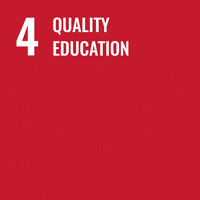
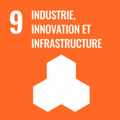

# 🌟 Aura - Public Speaking Perfector

## 🌍 Introduction
Aura is a web application designed to help individuals improve their public speaking skills. By leveraging cutting-edge AI technology, Aura provides users with personalized feedback and guidance to build confidence and become more effective communicators.

## 🛠️ Problem Statement & Solution
**Challenge**: Many people struggle with public speaking due to a lack of practice, feedback, and support. Aura addresses this by creating a comprehensive platform that helps users improve their oratory skills.

## 🎯 Objectives
Aura’s goal is to offer an interactive platform where users can practice, receive feedback, and engage in constructive debates. Key features include:
- Audio/Video submission
- AI-powered feedback
- Debating feature
- Personalized learning

## 💡 Proposed Solutions
Aura’s core features include:
- **Audio/Video Submission**: Users can record and submit their public speaking performances for analysis.
- **AI-Powered Feedback**: Advanced algorithms provide feedback to improve diction, tone, body language, and overall delivery.
- **Debating Feature**: Engage in topic-based discussions to practice argumentation and persuasive delivery.
- **Personalized Learning**: Customized learning paths based on individual needs and goals.

### 🚀 Debate Mode (Bot Simulation)
Our vision for Aura includes the addition of a **Debate Mode**. This feature would introduce a bot-powered simulation for debate practice, allowing users to engage in real-time debates on various topics with an AI-driven opponent. The Debate Mode aims to offer a realistic debate experience, enabling users to practice their argumentation skills in a structured and challenging environment. This advanced feature is part of our roadmap to further enhance Aura's capability in training effective communicators.

## ❓ What Problem Does It Solve?
Aura combines AI feedback and public speaking practice to address general speaking challenges. It helps users build confidence, clarity, and effectiveness in communication.

## 💼 Benefits
- **For Users**: Access to personalized feedback, resources, and a community to enhance public speaking abilities.
- **For Researchers**: Data and insights into factors influencing public speaking development for further study.
- **For the Public**: Awareness of public speaking’s importance, supporting the Aura platform's growth.

## 🌐 Opportunity
Aura presents a unique opportunity to transform public speaking improvement through technology, interaction, and community support, fostering personal and professional growth.

## 🔑 Key Features
- **Audio/Video Submission**
- **AI-Powered Feedback**
- **Debating Feature**
- **Personalized Learning**

## 🎯 Targeted SDGs
### **SDG 4: Quality Education**:

 Aura contributes to quality education by building essential communication skills.

  
### **SDG 8: Decent Work and Economic Growth**:

 Improved communication skills can enhance job and economic prospects.

### **SDG 9: Industry, Innovation, and Infrastructure**:

 Aura uses innovative technology for public speaking development.

  
### **SDG 17: Partnerships for the Goals**: 

 Aura fosters collaboration among individuals, researchers, and organizations.

## 🚀 Into The Future
### 🌈 What Will Aura Change?
Aura aims to transform how people improve their public speaking skills, empowering them to become confident, articulate, and effective communicators.

### 🌍 How Does Aura Benefit People?
Through its platform, Aura enables users to overcome speaking fears, develop communication abilities, and unlock new opportunities.

## 🔗 Project Links
- [Website]
## 👩‍👩‍👧‍👦 Our Talented Team
Meet the team behind Aura, dedicated to helping people succeed in public speaking!
